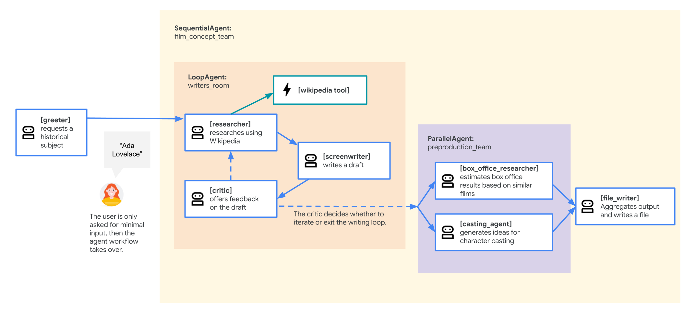

# Film concept team includes 

#### researcher
A researcher to learn more about the requested historical figure from Wikipedia, using a LangChain tool covered in the lab Empower ADK agents with tools. An agent can choose to call its tool(s) multiple times in succession, so the researcher can take multiple turns in a row if it determines it needs to do more research.

#### writer
A screenwriter to turn the research into a plot outline.

#### file_writer
A file_writer to title the resulting movie and write the results of the sequence to a file.

#### critic
A critic that will offer critical feedback on the current draft to motivate the next round of research and improvement through the loop.

# Steps to test the workflow agents
1. Run adk web
2. ADK Dev UI browser tab, and select workflow_agents from the dropdown.
3. Enter hello to begin a new conversation.
4. When prompted, enter a new character idea that you are interested in. e.g.: that actress who invented the technology for wifi
5. Output will be saved in directory called "movie_pitches", containing the movie script based on the character idea you provided.